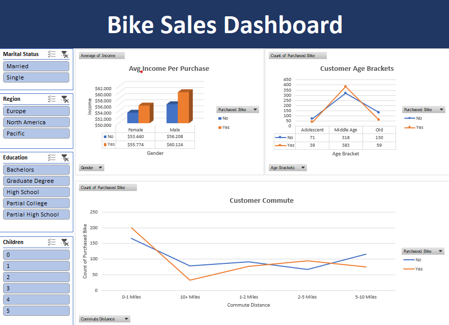

# Bike Sales Dashboard: Customer Demographics and Purchase Behavior Analysis

To create an interactive data dashboard using Microsoft Excel (or similar tools) to analyze and visualize the demographic and behavioral factors that influence customer bicycle purchasing decisions. The objective is to provide actionable insights for the Sales and Marketing teams.

---

## 🖼️ Dashboard Visualization

---

## 🎯 Project Goal

To create an **interactive data dashboard** using Microsoft Excel to analyze and visualize the demographic and behavioral factors that influence customer bicycle purchasing decisions. The objective is to provide **actionable insights** for the Sales and Marketing teams to optimize targeting and strategy.

## 📊 Data & Tools

| Category | Detail |
| :--- | :--- |
| **Data Used** | Bike Sales Data, including attributes such as Marital Status, Region, Education Level, Number of Children, Average Income, Age, and Daily Commute Distance. |
| **Primary Tool** | **Microsoft Excel** (Leveraging Pivot Tables, Pivot Charts, and Slicers for interactivity). |
| **Analytical Techniques** | **Customer Segmentation**, **Correlation Analysis** (Income vs. Purchase), and **Visualization of Purchasing Behavior Trends**. |

---

## 🔑 Key Insights & Findings

The dashboard allows for the exploration of several critical insights:

* **Average Income per Purchase:** Analysis reveals a clear difference in average income between customers who purchased a bike (**Yes**) and those who did not (**No**), further segmented by Gender. This helps in identifying income brackets most likely to convert.
* **Customer Age Brackets:** Clear purchasing behavior trends are observed across age segments (Adolescent, Middle Age, Old), identifying the age groups most likely to convert.
* **Customer Commute Distance:** Visualization demonstrates a strong correlation between a customer's daily **commute distance** (e.g., 0-1 Miles vs. 10+ Miles) and their decision to purchase a bicycle, suggesting varying needs based on lifestyle.
* **Interactive Filtering:** The dashboard provides instant filtering capabilities across key demographic dimensions (**Marital Status, Region, Education, Number of Children**) to enable deep-dive analysis by region or segment.

---

## ✅ Project Contribution and Value

| Area | Contribution Value |
| :--- | :--- |
| **Data-Driven Decisions** | Delivers a quick, accessible visual tool for the Sales team to **identify high-potential target markets** and focus resources effectively. |
| **Marketing Strategy** | Facilitates the adjustment of marketing strategies (e.g., targeted campaigns in specific regions or for specific education levels) based on **real-time data** from the dashboard. |
| **Technical Proficiency** | Demonstrates proven skills in **Data Modeling**, **Data Visualization**, and designing effective, user-friendly **Excel Dashboards** for business intelligence. |